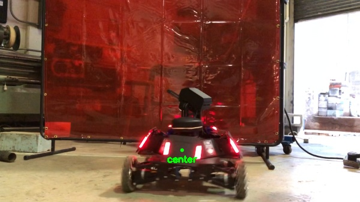

# Robomaster Armour Detector
This detector is intended to locate the center of the robot's armour panel. It works best when the panel is facing the camera and the background is not too bright and noisy. It struggles in situations where the LED strips are not vertical or are obstructed. It also struggles when the panels are far away from the camera, and the LEDs looks like vertical lines rather than rectangles.

### Run 
```
python detectArmour_image.py -i dataset/RoboMasterLabelledImagesSet1/image-550.jpg --save ./output/ --method blurr
```

### Method

- use a switch to choose between a saliency map or a gray to gaussian blur of the image (blurr tends to work better)
- threshold the image to isolate the strips
- use a shape detector to find the rectangular+pentagonal LED strips
- find the center coordinates of the LED strips
- compare the slopes between detections and choose the one with a slope close to 0
- also check that horizontal distance between detections is below a certain limit
- find the center of the target by averaging the coordinates of the two LED strips on the sides of the target


### Output
<p align="center">
  <br>
  
</p>